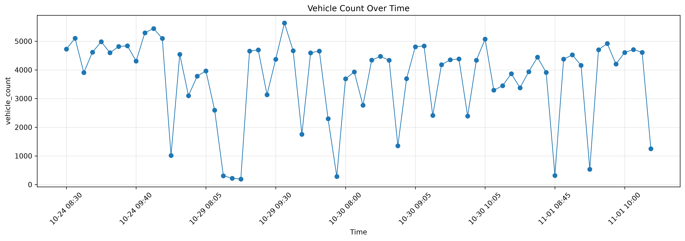
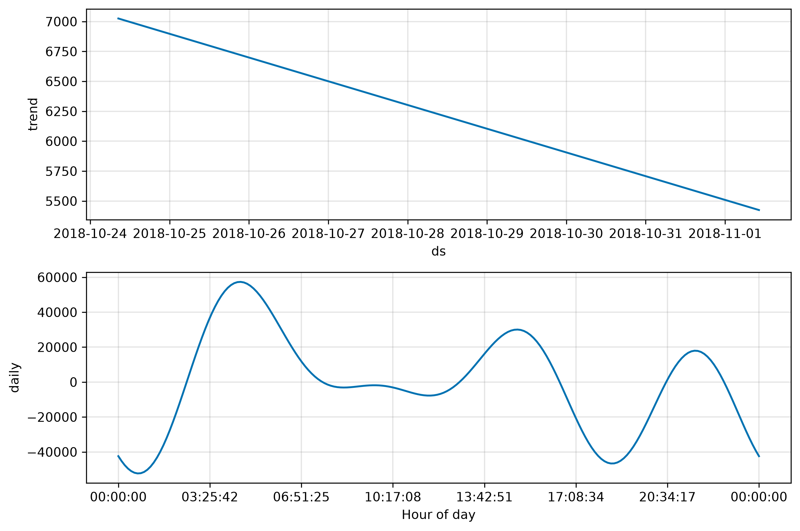
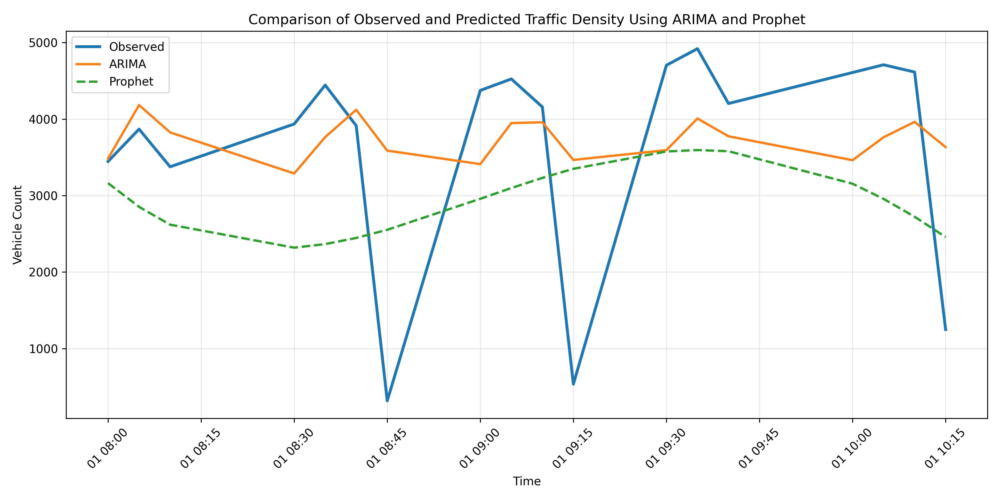
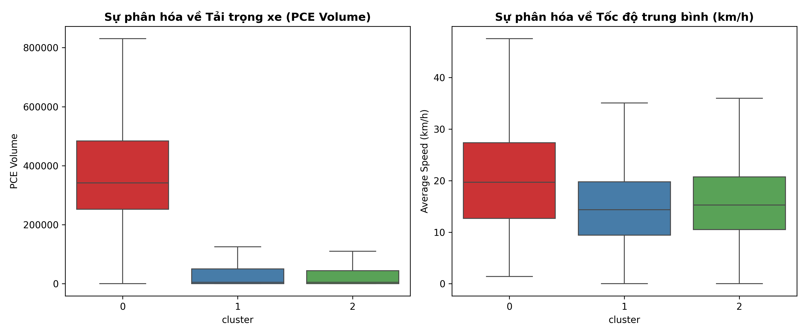

# 🚦 TrafficForecast
### Urban Traffic Pattern Analysis and Congestion Forecasting Using Drone-Based Traffic Monitoring

<p align="center">
    
    
    
    
    
    
</p>

---

# 📖 Overview

TrafficForecast is a **Time Series Forecasting** project designed to analyze urban traffic patterns and predict future traffic congestion using data collected from drone-based traffic monitoring systems.

Instead of forecasting from raw video directly, the project focuses on **traffic data analysis** after vehicle information has been extracted from aerial videos.

The project follows a complete Data Science workflow:

```
Drone Video
      │
      ▼
Vehicle Detection & Tracking
      │
      ▼
Traffic Dataset
      │
      ▼
Data Cleaning
      │
      ▼
Exploratory Data Analysis
      │
      ▼
Time Series Dataset
      │
      ▼
Forecasting Models
      │
      ▼
Traffic Congestion Prediction
```

---

# 🎯 Objectives

The primary objectives of this project are:

- Analyze urban traffic flow
- Explore traffic density patterns
- Build time-series datasets
- Forecast future traffic volume
- Compare forecasting models
- Evaluate prediction accuracy

---

# 📂 Project Structure

```
TrafficForecast
│
├── notebooks/
│   ├── 01_create_timeseries_dataset.ipynb
│   ├── 02_eda_timeseries.ipynb
│   ├── 03_baseline_arima.ipynb
│   └── 04_prophet_baseline.ipynb
│
├── reports/
│   ├── arima/
│   └── prophet/
│
├── scripts/
│   └── clean_each_file.py
│
├── src/
│   ├── analysis/
│   ├── preprocessing/
│   ├── visualization/
│   └── utils/
│
├── README.md
├── README_ARIMA.md
└── README_PROPHET.md
```

---

# 📊 Dataset

The project processes traffic monitoring data extracted from drone videos.

Each observation represents traffic statistics collected during a fixed time interval.

Typical features include:

| Feature | Description |
|----------|-------------|
| Timestamp | Observation time |
| Vehicle Count | Number of detected vehicles |
| Average Speed | Average traffic speed |
| Traffic Density | Density of vehicles |
| Vehicle Type | Car, Bus, Truck, Motorcycle |
| Lane Information | Road lane identifier |

The processed dataset is transformed into a **time-series format**, where:

- Time → Index
- Vehicle Count → Prediction Target

---

# 🔄 Workflow

## 1. Data Cleaning

Raw traffic datasets are cleaned by:

- Removing invalid records
- Handling missing values
- Standardizing timestamps
- Formatting columns
- Filtering noisy samples

Script:

```
scripts/clean_each_file.py
```

---

## 2. Time Series Construction

Notebook:

```
01_create_timeseries_dataset.ipynb
```

Tasks:

- Convert timestamps
- Aggregate traffic counts
- Generate fixed interval observations
- Create forecasting dataset

Output:

```
traffic_density_timeseries.csv
```

---

## 3. Exploratory Data Analysis

Notebook:

```
02_eda_timeseries.ipynb
```

Includes:

- Distribution analysis
- Correlation analysis
- Vehicle distribution
- Density visualization
- Speed analysis
- Traffic trends

Visualizations include:

- Histogram
- Scatter Plot
- Correlation Heatmap
- Boxplot
- Traffic Density Map
- Vehicle Type Distribution

---

# 📈 Forecasting Models

The project compares two forecasting approaches.

---

## Model 1 — ARIMA

Notebook:

```
03_baseline_arima.ipynb
```

Pipeline:

```
Time Series

↓

Stationarity Test

↓

ADF Test

↓

ACF / PACF

↓

Grid Search

↓

Best ARIMA Model

↓

Prediction

↓

Evaluation
```

Features:

- Stationarity checking
- Automatic parameter tuning
- Forecast future traffic volume

Outputs:

- Best model
- Forecast figures
- Performance metrics

---

## Model 2 — Prophet

Notebook:

```
04_prophet_baseline.ipynb
```

Pipeline:

```
Traffic Dataset

↓

Rename columns

↓

Train Prophet

↓

Forecast

↓

Evaluation
```

Prophet automatically models:

- Trend
- Seasonality
- Holidays (optional)
- Long-term changes

---

# 📊 Evaluation Metrics

The forecasting performance is evaluated using:

- MAE (Mean Absolute Error)
- RMSE (Root Mean Squared Error)
- MSE (Mean Squared Error)

Comparison between ARIMA and Prophet is performed to determine the better forecasting model.

---

# 📁 Reports

The generated outputs are stored under:

```
reports/
```

Including:

```
reports/
│
├── arima/
│   ├── figures/
│   ├── models/
│   └── tables/
│
└── prophet/
    ├── figures/
    ├── models/
    └── tables/
```

Saved artifacts include:

- Trained models
- Prediction tables
- Evaluation metrics
- Forecast plots

---

## Visual summary

The following figures illustrate core results from the ARIMA and Prophet pipelines.



*Traffic volume observed over time for the analyzed drone traffic dataset.*


*ARIMA model predictions compared with actual traffic volume in the test set.*


*Prophet forecast results with actual traffic measurements and forecast interval.*



*Prophet model decomposition showing trend and daily seasonality behavior.*



*Comparison of observed traffic density with ARIMA and Prophet forecasts.*


*K-Means clustering results showing congestion hotspot regions in the analyzed traffic dataset.*



*Cluster-level distribution of PCE volume and average speed as evidence of congestion segmentation.*

---

# 🧠 Technologies

- Python
- Pandas
- NumPy
- Matplotlib
- Seaborn
- Statsmodels
- Prophet
- Scikit-Learn
- Jupyter Notebook

---

# 📌 Key Features

✔ Traffic Pattern Analysis

✔ Traffic Density Analysis

✔ Vehicle Count Forecasting

✔ Time Series Construction

✔ Exploratory Data Analysis

✔ ARIMA Forecasting

✔ Prophet Forecasting

✔ Model Comparison

✔ Visualization Dashboard

---

# 🚀 How to Run

## Clone repository

```bash
git clone https://github.com/yourusername/TrafficForecast.git

cd TrafficForecast
```

---

## Install dependencies

```bash
pip install -r requirements.txt
```

---

## Run notebooks

Execute notebooks in the following order:

```
01_create_timeseries_dataset.ipynb

↓

02_eda_timeseries.ipynb

↓

03_baseline_arima.ipynb

↓

04_prophet_baseline.ipynb
```

---

# 📈 Future Improvements

Potential future work includes:

- LSTM
- GRU
- Transformer-based Forecasting
- Temporal Fusion Transformer
- Graph Neural Networks
- Real-time Traffic Prediction
- Live Dashboard
- API Deployment
- Multi-camera Integration

---

# 👥 Authors

TrafficForecast was developed as an academic project focusing on traffic analysis and time-series forecasting using drone-based traffic monitoring data.

---

# 📚 References

- Facebook Prophet
- Statsmodels ARIMA
- Scikit-Learn Documentation
- Pandas Documentation
- Time Series Forecasting Literature

---

# 📜 License

This project is intended for educational and research purposes.

MIT License.

---

<p align="center">
Made with ❤️ for Urban Traffic Forecasting and Data Science
</p>