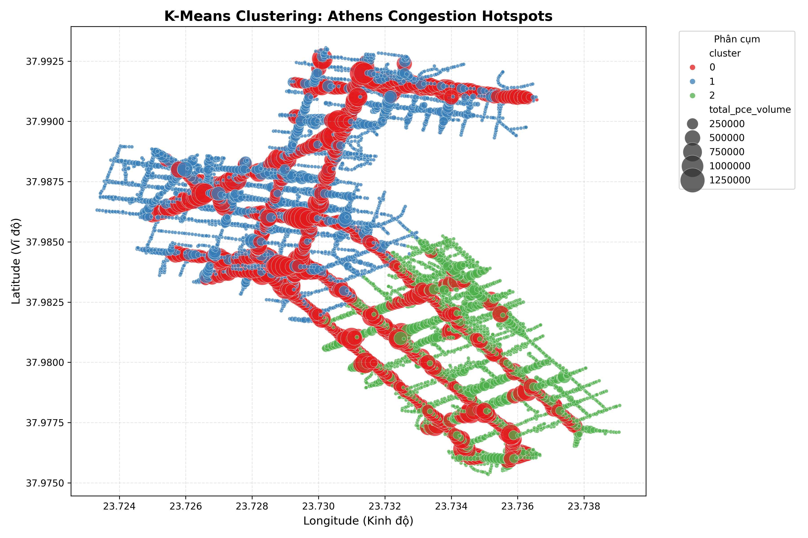
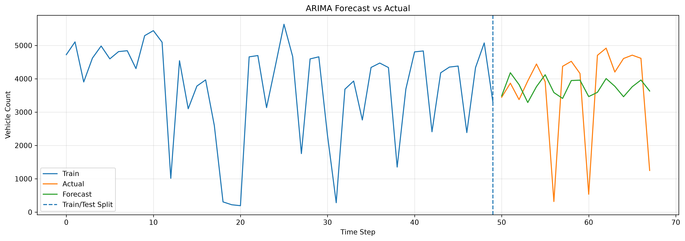
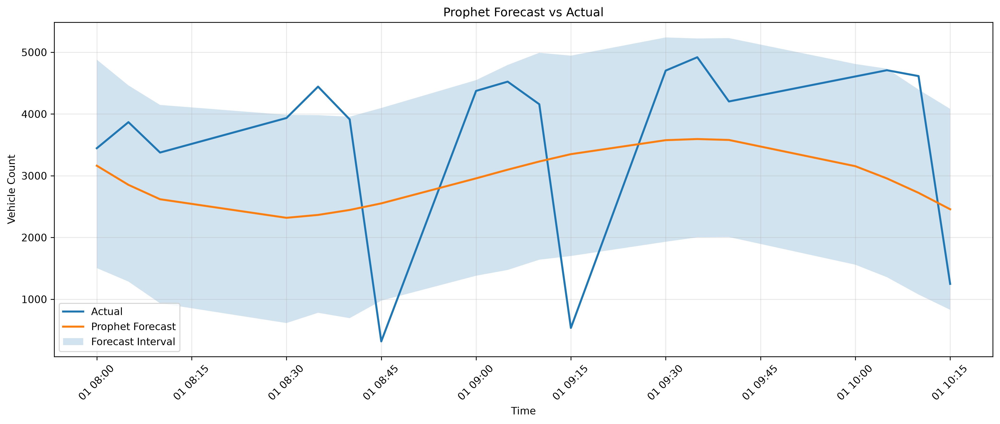
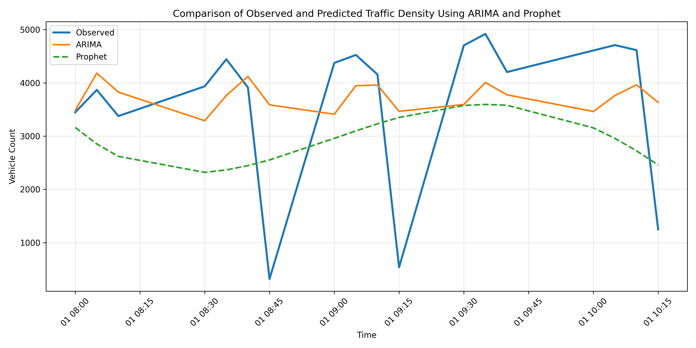

# 🚦 TrafficForecast
### Urban Traffic Pattern Analysis and Congestion Forecasting Using Drone-Based Traffic Monitoring

<p align="center">
    
    
    
    
    
    
</p>

---

# Overview

TrafficForecast processes drone-derived vehicle tracking data and produces congestion forecasts using clustering and time-series models. The pipeline focuses on extracting structured traffic features, identifying congestion hotspots, and comparing ARIMA versus Prophet prediction performance.

---

# Data

The raw traffic dataset includes these columns:

- `track_id`
- `type`
- `traveled_d`
- `avg_speed`
- `lat`
- `lon`
- `speed`
- `lon_acc`
- `lat_acc`
- `time`

---

# Feature

The feature set used for modeling includes:

- `track_id`
- `type`
- `traveled_d`
- `avg_speed`
- `lat`
- `lon`
- `speed`
- `lon_acc`
- `lat_acc`
- `time`
- `timestamp_real`
- `time_str`
- `time_bin_5m`
- `unique_track_id`
- `grid_id`
- `is_crawling`
- `is_hard_braking`
- `pce_factor`

These engineered features support temporal binning, spatial indexing, and traffic behavior classification.

---

# Train / Test

The workflow uses a holdout split of:

- `75%` training
- `25%` testing

This split evaluates model generalization to unseen traffic conditions.

---

# K-means

K-Means is applied to identify traffic congestion hotspots and spatial clusters.



**K-Means final metrics:**

- Silhouette Score = `0.3097`
- Davies-Bouldin Index = `1.1522`

---

# Arima

The ARIMA model forecasts traffic density on the processed time-series dataset.



**ARIMA final metrics:**

- MAE = `991.7891097332208`
- RMSE = `1340.8440748522846`
- MAPE = `109.78352848281729%`
- R2 = `0.07657161300859172`

---

# Prophet

Prophet is evaluated as a second forecasting approach to compare against ARIMA.



**Prophet final metrics:**

- MAE = `1411.817931776563`
- RMSE = `1531.2018068765954`
- MAPE = `98.23793896304693%`
- R2 = `-0.20423579582625195`

---

# Comparison

The following figure compares observed traffic density with ARIMA and Prophet forecasts.



---

# Environment Setup

## Setup

```bash
git clone https://github.com/KLiii18/TrafficForecast.git
cd TrafficForecast/src
python -m venv .venv
.venv\Scripts\activate
pip install -r requirements.txt
```

## K-means

```bash
python models/kmeans/step2_kmeans_advanced.py
```

## Arima

```bash
python -m src.models.arima.train
```

## Prophet

```bash
python -m src.models.prophet.train
```

---

